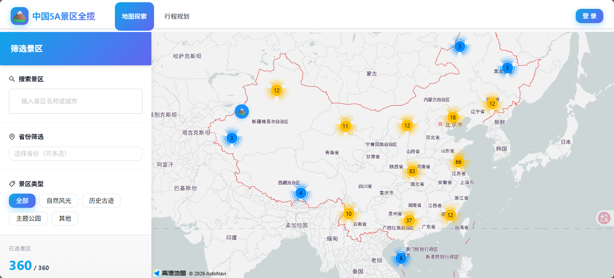

# 中国5A景区全揽

一个整合中国358个5A级旅游景区信息的综合性旅游网站。


## 功能特性

- **交互式地图展示**：在高德地图上直观显示所有5A景区的地理位置分布
- **景区信息展示**：展示景区百科信息、详细介绍、特色亮点、门票信息、开放时间等
- **省份筛选功能**：按省份分类查询景区
- **旅游规划功能**：帮助用户创建和管理旅游行程
- **用户系统**：支持微信/QQ登录（预留接口），收藏景区

## 技术栈

### 前端
- Vue 3 + TypeScript
- Ant Design Vue 4
- Vue Router 4
- Pinia
- Vite
- 高德地图 SDK

### 后端
- Node.js + Fastify
- TypeScript
- MongoDB + Mongoose

## 项目结构

```
travel-map/
├── frontend/          # 前端项目
├── backend/           # 后端项目
├── data/              # 数据文件
│   └── scenic-spots.json  # 景区初始数据
└── docs/              # 文档
```

## 快速开始

### 环境要求

- Node.js 18+
- MongoDB 6+

### 安装依赖

```bash
# 安装前端依赖
cd frontend
npm install

# 安装后端依赖
cd ../backend
npm install
```

### 配置环境变量

在 `backend/.env` 文件中配置：

```env
PORT=3000
MONGODB_URI=mongodb://localhost:27017/travel-map
JWT_SECRET=your-jwt-secret-key
AMAP_KEY=your-amap-api-key  # 可选，用于获取景区坐标
```

### 导入景区数据

```bash
cd backend
npm run import
```

### 启动开发服务器

```bash
# 启动后端服务
cd backend
npm run dev

# 启动前端服务（新终端）
cd frontend
npm run dev
```

访问 http://localhost:5173 查看网站。

## API 文档

### 景区相关

- `GET /api/spots` - 获取景区列表
- `GET /api/spots/:id` - 获取景区详情
- `GET /api/spots/provinces` - 获取省份列表
- `GET /api/spots/search/:keyword` - 搜索景区

### 用户相关

- `POST /api/auth/dev-login` - 测试登录
- `GET /api/user/profile` - 获取用户信息
- `POST /api/user/favorites` - 添加收藏
- `DELETE /api/user/favorites/:spotId` - 取消收藏

### 行程相关

- `GET /api/plans` - 获取用户行程列表
- `POST /api/plans` - 创建行程
- `GET /api/plans/:id` - 获取行程详情
- `PUT /api/plans/:id` - 更新行程
- `DELETE /api/plans/:id` - 删除行程

## 部署

推荐使用腾讯云轻量应用服务器部署：

1. 构建前端：`cd frontend && npm run build`
2. 构建后端：`cd backend && npm run build`
3. 使用 PM2 管理后端进程
4. 使用 Nginx 代理前端静态文件和后端 API


## License

MIT
